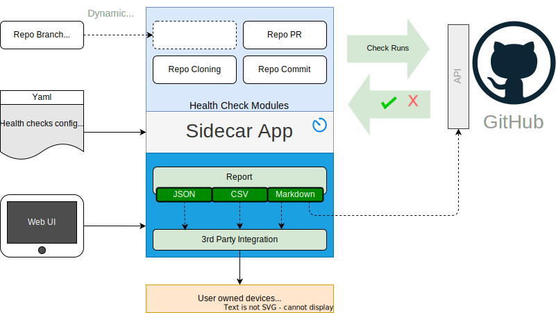

# GHEC Health Check App

 A GitHub App  to run a set of Health checks against the GitHub platform API.
<br><br><br>




(Built with [Probot](https://github.com/probot/probot))

## Setup

- REACT App

    In the REACT App root folder

    ```sh
    # Install dependencies
    npm install

    # build the react app
    npm run build
    ```

- Probot App root folder

    ```sh
    # Install dependencies
    npm install
    ```

    ```sh
    # Run the bot
    npm start
    ```

- Access the app at `http://localhost:3000` (default)
- Access the UI at `http://localhost:3000/health-check` (default)

---

## Docker

```sh
# 1. Build container
docker build -t health-check-app .

# 2. Start container
docker run -e APP_ID=<app-id> -e PRIVATE_KEY=<pem-value> health-check-app
```

## Contributing

If you have suggestions for how health-check-app could be improved, or want to report a bug, open an issue! We'd love all and any contributions.

For more, check out the [Contributing Guide](CONTRIBUTING.md).

## License

[ISC](LICENSE) © 2023 Jürgen Efeish
